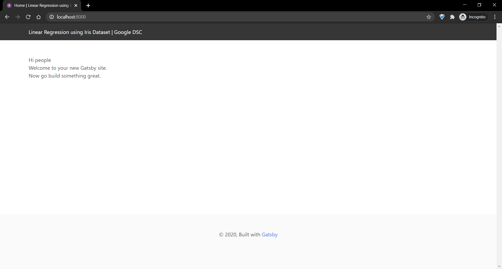

# Pre-requesites

## Terminal

You will need a terminal to run this to build the website and run the development server.

For Windows, Command Prompt or PowerShell are just fine.

I use Windows Terminal which you can find [here](https://www.microsoft.com/en-us/p/windows-terminal/9n0dx20hk701)

On MacOS and Linux you can use the default terminal

## Code Editor

You will need a code editor for this workshop. I generally prefer [Visual Studio Code ](https://code.visualstudio.com/) but [Sublime Text](https://www.sublimetext.com/3) or [Notepad++](https://notepad-plus-plus.org/downloads/) work just fine.

## React Developer Tools

You can use the Developer Tools Extension on your browser of choice to see which components are mounted, what their current state is, etc. It's a pretty nifty extension.

You can download it for Chrome [here](https://chrome.google.com/webstore/detail/react-developer-tools/fmkadmapgofadopljbjfkapdkoienihi?hl=en) and for Firefox [here](https://addons.mozilla.org/en-US/firefox/addon/react-devtools/)

## NodeJS

You will need to have NodeJS installed on your system as we need npm to install Gatsby CLI and the dependencies we need to build our website. Download and install the LTS version for your operating system from [here](https://nodejs.org/en/download/).

## Gatsby CLI

Once you have NodeJS installed and set up, open up your terminal. You can install `gatsby-cli` by running `npm install -g gatsby-cli`

## Clone starter code

Once you have Gatsby CLI installed, you can set up the starter code for the workshop on your system by running `gatsby new iris-spa https://github.com/karanrajpal14/iris-dsc-starter`

```
PS C:\Users\Karan> gatsby new iris-spa https://github.com/karanrajpal14/iris-dsc-starter
info Creating new site from git: https://github.com/karanrajpal14/iris-dsc-starter.git
Cloning into 'iris-spa'...
...
...
Your new Gatsby site has been successfully bootstrapped. Start developing it by running:

  cd iris-spa
  gatsby develop
```

Next, we need to start the development server and check if everything went well.
To do that, we need to change our directory to the one that we just created and run `gatsby develop`. Here's what that looks like:

```shell
PS C:\Users\Karan> cd iris-spa

PS C:\Users\Karan\iris-spa> gatsby develop
success open and validate gatsby-configs - 0.041s
success load plugins - 0.656s
success onPreInit - 0.029s
success initialize cache - 0.008s
success copy gatsby files - 0.059s
success onPreBootstrap - 0.016s
success createSchemaCustomization - 0.005s
success Checking for changed pages - 0.002s
success source and transform nodes - 0.119s
success building schema - 0.277s
info Total nodes: 39, SitePage nodes: 1 (use --verbose for breakdown)
success createPages - 0.004s
success Checking for changed pages - 0.001s
success createPagesStatefully - 0.060s
success update schema - 0.017s
success write out redirect data - 0.002s
success Build manifest and related icons - 0.096s
success onPostBootstrap - 0.103s
info bootstrap finished - 3.620s
success onPreExtractQueries - 0.002s
success extract queries from components - 0.227s
success write out requires - 0.037s
success run static queries - 2.970s - 3/3 1.01/s
success run page queries - 0.043s - 4/4 92.83/s
success Generating image thumbnails - 6.625s - 30/30 4.53/s
⠀
You can now view gatsby-starter-default in the browser.
⠀
  http://localhost:8000/
⠀
View GraphiQL, an in-browser IDE, to explore your site's data and schema
⠀
  http://localhost:8000/___graphql
⠀
Note that the development build is not optimized.
To create a production build, use gatsby build
⠀
success Building development bundle - 4.861s
```

If you see that, great. We are all done. Open up the URL shown above i.e. `http://localhost:8000/` in your browser and you should see the following page:


