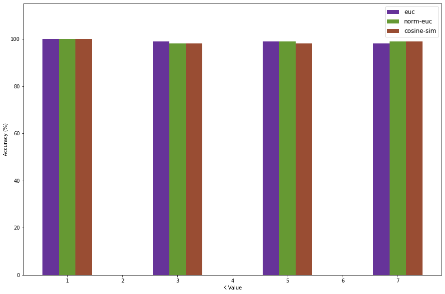

In this project we will be implementing the KNN algorithm from scratch. We will implement the algorithm for the K values 1, 3, 5 and 7 and see which one is performing better. Also, we will implement multiple distance measures and compare accurac across all of them.

We begin by importing the necessary libraries


```python
import math

import matplotlib.pyplot as mp
import numpy as np
import pandas as pd
```


```python
DATA = "../data/iris.data"
SPLIT_PERCENT = 0.7
K_VALUES = [1, 3, 5, 7]
DIST_METRICS = ["euc", "norm-euc", "cosine-sim"]
```

We now prepare the dataset for further processing. To do this we first load the data, shuffle it randomly and map the classes to integers for easier processing


```python
dataset = pd.read_csv(DATA).sample(frac=1).reset_index(drop=True)

# Map class names to integers
iris_class_map = {v: k + 1 for k, v in enumerate(dataset['class'].unique())}
dataset['class'] = dataset['class'].map(iris_class_map)

RECORDS_COUNT, ATTR_COUNT = dataset.shape
ATTRS = dataset.columns.values[0:ATTR_COUNT - 1]
SPLIT_SIZE = math.floor(RECORDS_COUNT * SPLIT_PERCENT)

# List of columns for every K Value
K_COL_STRINGS = ["pred_k_{}".format(k) for k in K_VALUES]
for col in K_COL_STRINGS:
	dataset[col] = np.nan

# Split dataset for dev and test
dev_set = dataset[:SPLIT_SIZE].copy(deep=True)
test_set = dataset[SPLIT_SIZE:].copy(deep=True)

print("Dev data")
dev_set.head()
```

    Dev data


|   | sepal\_len | sepal\_wid | petal\_len | petal\_wid | class | pred\_k\_1 | pred\_k\_3 | pred\_k\_5 | pred\_k\_7 |
|---|------------|------------|------------|------------|-------|------------|------------|------------|------------|
| 0 | 5\.0       | 3\.6       | 1\.4       | 0\.2       | 1     | NaN        | NaN        | NaN        | NaN        |
| 1 | 7\.0       | 3\.2       | 4\.7       | 1\.4       | 2     | NaN        | NaN        | NaN        | NaN        |
| 2 | 6\.8       | 2\.8       | 4\.8       | 1\.4       | 2     | NaN        | NaN        | NaN        | NaN        |
| 3 | 5\.7       | 2\.8       | 4\.1       | 1\.3       | 2     | NaN        | NaN        | NaN        | NaN        |
| 4 | 5\.5       | 2\.4       | 3\.8       | 1\.1       | 2     | NaN        | NaN        | NaN        | NaN        |


Now that our data is prepared, we need to find the nearest neighbors for every K value. To do this, we first need to calculate the Euclidian distance for every row in the dev set against every other row. Once we have the distances, we find the K Nearest Neighbors for every K value and use this to predict the class of the selected vector.

Once we make our predictions, we need to calculate the accuracy as well.


```python
# Find K nearest neighbors for all values of K
for index, k in enumerate(K_VALUES):
	calculated_pred = []
	for i, row in dev_set.iterrows():
        # Calculate euclidian distance        
		calculated_dist = (dev_set[ATTRS].sub(row[ATTRS]).pow(2).sum(1).pow(0.5)).sort_values()
        # Get indices of nearest neighbors        
		nearest_neighbor_indices = calculated_dist.iloc[0:k].index.values
        # Get nearest neighbors        
		nearest_neighbors = dev_set.loc[nearest_neighbor_indices, :]['class']
        # Predict class of the vector        
		prediction = nearest_neighbors.mode().values[0]
		calculated_pred.append(prediction)
	dev_set[K_COL_STRINGS[index]] = calculated_pred

# Calculating accuracy
euc_accuracy = []

for col in dev_set[K_COL_STRINGS]:
	column = dev_set[col]
	total_rows = dev_set.shape[0]
	num = dev_set.loc[dev_set['class'] == column].shape[0]
	acc = round((num/total_rows) * 100, 5)
	euc_accuracy.append(acc)

print(euc_accuracy)
```

    [100.0, 99.04762, 99.04762, 98.09524]


Now, follow the same process but instead we use a normalized euclidian distance as a metric. To do this, we normalize the dataset and calculate the euclidian distance again. This allows us to deal with outliers and ensure we are correctly scaling the data


```python
# Normalize data
def normalize(dataframe):
	df = dataframe.copy(deep=True)
	for col in df[ATTRS]:
		df[col] = (df[col] - df[col].min()) / (df[col].max() - df[col].min())
	return df

norm_dev_set = normalize(dev_set)

# Reset the prediction columns
for col in K_COL_STRINGS:
	norm_dev_set[col] = np.nan

norm_dev_set.head()
```


|   | sepal\_len | sepal\_wid | petal\_len | petal\_wid | class | pred\_k\_1 | pred\_k\_3 | pred\_k\_5 | pred\_k\_7 |
|---|------------|------------|------------|------------|-------|------------|------------|------------|------------|
| 0 | 0\.194444  | 0\.842105  | 0\.067797  | 0\.043478  | 1     | NaN        | NaN        | NaN        | NaN        |
| 1 | 0\.750000  | 0\.631579  | 0\.627119  | 0\.565217  | 2     | NaN        | NaN        | NaN        | NaN        |
| 2 | 0\.694444  | 0\.421053  | 0\.644068  | 0\.565217  | 2     | NaN        | NaN        | NaN        | NaN        |
| 3 | 0\.388889  | 0\.421053  | 0\.525424  | 0\.521739  | 2     | NaN        | NaN        | NaN        | NaN        |
| 4 | 0\.333333  | 0\.210526  | 0\.474576  | 0\.434783  | 2     | NaN        | NaN        | NaN        | NaN        |


Once the dataset is normalized, we follow the same process to calculate the euclidian distance and predict


```python
# Predict using normalized data for all K values
for index, k in enumerate(K_VALUES):
	calculated_pred = []
	for i, row in norm_dev_set.iterrows():
		calculated_dist = (norm_dev_set[ATTRS].sub(row[ATTRS]).pow(2).sum(1).pow(0.5)).sort_values()
		nearest_neighbor_indices = calculated_dist.iloc[0:k].index.values
		nearest_neighbors = norm_dev_set.loc[nearest_neighbor_indices, :]['class']
		prediction = nearest_neighbors.mode().values[0]
		calculated_pred.append(prediction)
	norm_dev_set[K_COL_STRINGS[index]] = calculated_pred

norm_euc_accuracy = []

for col in norm_dev_set[K_COL_STRINGS]:
	column = norm_dev_set[col]
	total_rows = norm_dev_set.shape[0]
	num = norm_dev_set.loc[dev_set['class'] == column].shape[0]
	acc = round((num/total_rows) * 100, 5)
	norm_euc_accuracy.append(acc)

print(norm_euc_accuracy)
```

    [100.0, 98.09524, 99.04762, 99.04762]


For the final iteration, we will use Cosine Similarity as a distance metric


```python
# Dot product
def dot(A, B):
	return sum(a * b for a, b in zip(A, B))

# Cosine Similarity
def cosine_similarity(a, b):
	return 1 - dot(a, b) / ((np.sqrt(dot(a, a))) * (np.sqrt(dot(b, b))))

cosine_dev_set = dev_set.copy(deep=True)

for index, k in enumerate(K_VALUES):
	calculated_pred = []
	for i, row in cosine_dev_set.iterrows():
		calculated_dist = cosine_dev_set[ATTRS].apply(lambda a: cosine_similarity(np.array(a), np.array(row[ATTRS])), axis=1).sort_values()
		nearest_neighbor_indices = calculated_dist.iloc[0:k].index.values
		nearest_neighbors = cosine_dev_set.loc[nearest_neighbor_indices, :]['class']
		prediction = nearest_neighbors.mode().values[0]
		calculated_pred.append(prediction)
	cosine_dev_set[K_COL_STRINGS[index]] = calculated_pred

cosine_accuracy = []

for col in cosine_dev_set[K_COL_STRINGS]:
	column = cosine_dev_set[col]
	total_rows = cosine_dev_set.shape[0]
	num = cosine_dev_set.loc[dev_set['class'] == column].shape[0]
	acc = round((num/total_rows) * 100, 5)
	cosine_accuracy.append(acc)

print(cosine_accuracy)
```

    [100.0, 98.09524, 98.09524, 99.04762]


Now, we need to analyze the accuracy of all these distance metrics across all the K values and pick the one that's doing the best job. To do this


```python
acc_table = pd.DataFrame(index=K_VALUES)
acc_table[DIST_METRICS[0]] = euc_accuracy
acc_table[DIST_METRICS[1]] = norm_euc_accuracy
acc_table[DIST_METRICS[2]] = cosine_accuracy
acc_table
```


|   | euc        | norm\-euc  | cosine\-sim |
|---|------------|------------|-------------|
| 1 | 100\.00000 | 100\.00000 | 100\.00000  |
| 3 | 95\.23810  | 95\.23810  | 98\.09524   |
| 5 | 96\.19048  | 95\.23810  | 98\.09524   |
| 7 | 98\.09524  | 96\.19048  | 98\.09524   |


```python
width = 0.3
mp.figure(figsize=(15, 10))
mp.ylim(0, 115)
e = mp.bar(x=np.add(K_VALUES, width * -1), height=euc_accuracy, width=width, color='#663399')
n = mp.bar(x=np.add(K_VALUES, width * 0), height=norm_euc_accuracy, width=width, color='#669933')
c = mp.bar(x=np.add(K_VALUES, width * 1), height=cosine_accuracy, width=width, color='#994d33')

mp.legend(DIST_METRICS, loc="best", fontsize=12)
mp.xlabel("K Value")
mp.ylabel("Accuracy (%)")
mp.show()
```





We see that at K = 1, we get 100% accuracy. This is mainly because overfitting is occuring. From my observations K values 3 and 5 seem to be most stable and the accuracy for K = 7 usually decreases. This is why I will be choosing K = 3 and the Normalized Euclidian distance since it is stable to test the accuracy of the test dataset.


```python
k_val = 3
norm_test_set = normalize(test_set)

calculated_pred = []
for i, row in norm_test_set.iterrows():
	calculated_dist = (norm_test_set[ATTRS].sub(row[ATTRS]).pow(2).sum(1).pow(0.5)).sort_values()
	nearest_neighbor_indices = calculated_dist.iloc[0:k_val].index.values
	nearest_neighbors = norm_test_set.loc[nearest_neighbor_indices, :]['class']
	prediction = nearest_neighbors.mode().values[0]
	calculated_pred.append(prediction)
norm_test_set[K_COL_STRINGS[1]] = calculated_pred

norm_euc_accuracy = []

column = norm_dev_set[K_COL_STRINGS[1]]
total_rows = norm_dev_set.shape[0]
num = norm_dev_set.loc[dev_set['class'] == column].shape[0]
acc = round((num/total_rows) * 100, 5)
norm_euc_accuracy.append(acc)

print(norm_euc_accuracy)
```

    [98.09524]

The final accuracy we get on the test set is around ~98% which is pretty good

### The notebook can be downloaded [here](/knn.ipynb) if you'd like to review it

## References:

[Develop k-Nearest Neighbors in Python From Scratch - Machine Learning Mastery](https://machinelearningmastery.com/tutorial-to-implement-k-nearest-neighbors-in-python-from-scratch/)